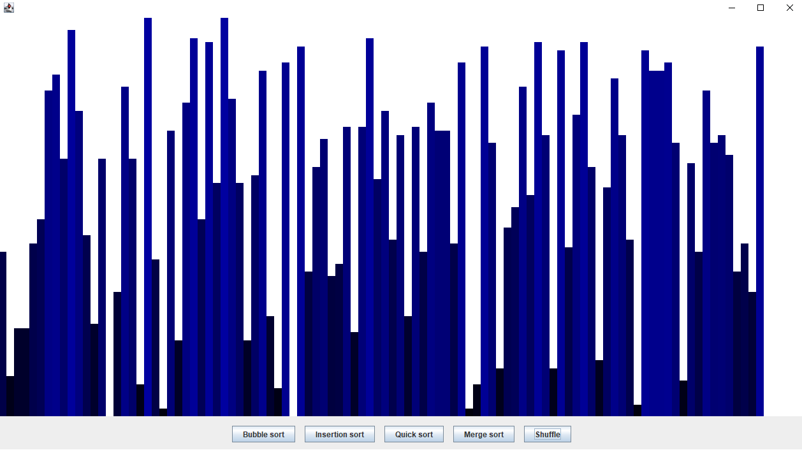
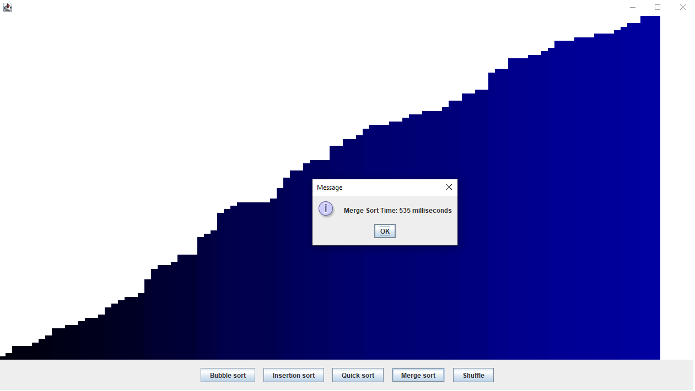
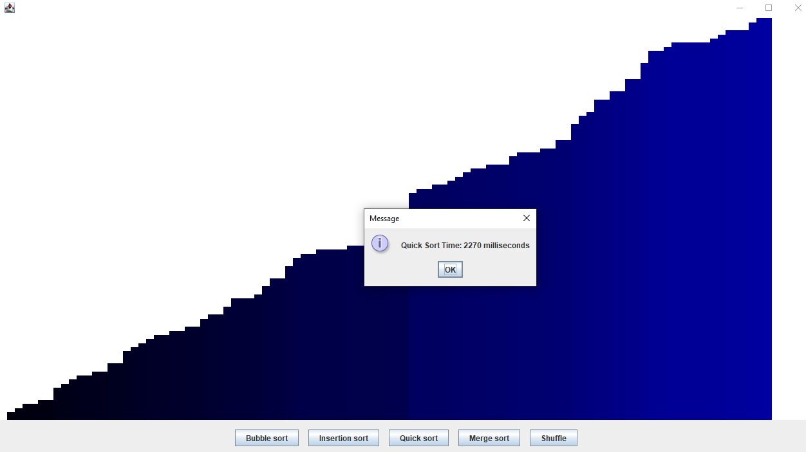

# Java Swing Sorting Visualization

This project provides a visual representation of sorting algorithms implemented using Java Swing. It allows users to observe how different sorting algorithms work by visually tracking the changes made to the elements during the sorting process.

## Sorting Algorithms

The project currently supports the following sorting algorithms:

- Bubble Sort
- Insertion Sort
- Quick Sort
- Merge Sort
### 
- 
- 
- 
